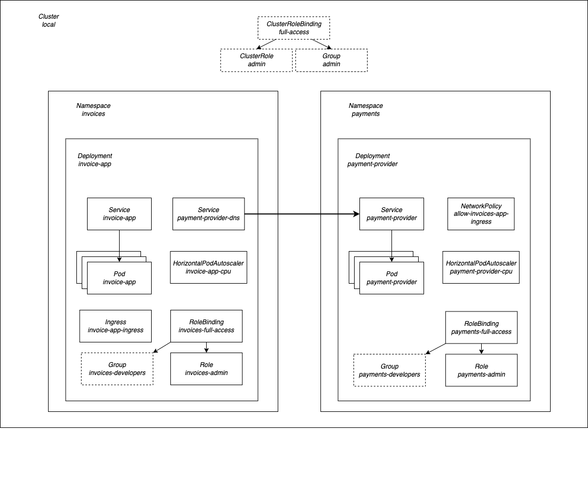

# sre-challenge

Code challenge hand-out during the recruitment process of Aleksander Nowak, for the position of a Site Reliability Engineer/DevOps Engineer.
Thank you for taking the time to review my submission. Should you have any questions, please feel free to reach out!

Overall diagram of the solution:



## Requirements

macOS machine with `brew` installed.

### Recommended binaries

- [Docker Desktop](https://docs.docker.com/desktop/install/mac-install/)
- [Minikube](https://minikube.sigs.k8s.io/docs/start/)
- [hyperkit](https://minikube.sigs.k8s.io/docs/drivers/hyperkit/)
- [Pulumi](https://www.pulumi.com/docs/get-started/install/)

## Local Development

Setup script in the repo will install all required binaries, configure your local development environment and deploy all microservices to it.
Note that it may upgrade versions of some of the binaries to latest.

```sh
make deploy-local
```

Resulting should be a local Minikube Kubernetes cluster running inside the VM on your local machine, with applications deployed to it via
Pulumi with local filesystem backends.

### Updating projects individually
You can control local Pulumi stacks using individually using the provided NPM scripts under `invoice-app/iac/package.json` and `payment-provider/iac/package.json`.
```sh
cd ${PROJECT_ROOT}/invoice-app/iac
npm run up-local 
npm run refresh-local
npm run destroy-local

cd ${PROJECT_ROOT}/payment-provider/iac
npm run up-local
npm run refresh-local
npm run destroy-local
```

### Updating all projects in bulk
You can also update all microservices at the same time using NPM scripts provided with the `iac-automation/package.json` project.
```sh
cd ${PROJECT_ROOT}/iac-automation
npm run up-local
npm run destroy-local
```

## Integration Testing
Integration tests reside under `test/integration` project. They can be executed against the local environment with a provided script.
```sh
make test-integration-local
```
### Known Issue: **Get "http://192.168.64.15/invoices": context deadline exceeded (Client.Timeout exceeded while awaiting headers)**
Occasionally, network exposed by the VM that runs Minikube will be unreachable from host, and will result in tests failing. Note that
your IP shown in the error message might differ. If that happens, the following should help:
- Recreating local setup from scratch with
```sh
make deploy-local
make test-integration-local
```
- Creating a port-forward into the `invoice-app` pod and running tests manually
```sh
podName=$(kubectl get pod -n invoices --template '{{range .items}}{{.metadata.name}}{{"\n"}}{{end}}' | head -n1)
kubectl port-forward -n invoices "${podName}" 8081:8081 & // Runs port-forward in the background. You can safely exit the shell (f.x. Ctrl+C)
cd test/integration/invoices
go test // Runs test with target API set to 'http://localhost:8081' (default)
pkill kubectl // Rerminates the background port-forward
```

## Setup - Solution
- [x] 0.1 Fork this repository
- [x] 0.2 Create a new branch for you to work with.
- [x] 0.3 Install any local K8s cluster (ex: Minikube) on your machine and document your setup so we can run your solution.

I provided a simple setup script which installs all neccessary binaries and configures a local environment running in Minikube
from scratch.

## Part 1 - Solution
- [x] 1.1 Find a bug in the setup.
- [x] 1.2 Write in README-old.md about the :bug:, the fix, how you found it, and anything else you want to share.

Running pods as non-root is a good security practice, but also a common source of troubles with running containers
inside Kubernetes. I luckily suspected this might be the bug right from the beginning. After I have deployed apps
to Kubernetes, the were crash looping (with surprisingly expressive error message), so I could start solving the problem.
In this case, the app did not require any root access, so Dockerfile was changed to create a new non-root user and
switch to it before running the app binary. Additionally, I slimmed down the image size by removing unnessesary build
materials, which is a common practice for Go applications.

## Part 2 - Solution
- [x] 2.1 Deploy both apps to Kubernetes.
- [x] 2.2 `invoice-app` must be reachable from outside the cluster.
- [x] 2.3 `payment-provider` must be only reachable from inside the cluster.
- [x] 2.4 Update existing `deployment.yaml` files to follow k8s best practices. Feel free to remove existing files, recreate them, and/or introduce different technologies. Follow best practices for any other resources you decide to create.
- [x] 2.5 Provide a better way to pass the URL in `invoice-app/main.go` - it's hardcoded at the moment
- [x] 2.6 Complete `deploy.sh` in order to automate all the steps needed to have both apps running in a K8s cluster.
- [x] 2.7 Complete `test.sh` so we can validate your solution can successfully pay all the unpaid invoices and return a list of all the paid invoices.

Regarding 2.1, I deployed both apps to Kubernetes using Pulumi IAC. I considered instaling local ArgoCD instance to do K8s GitOps, however,
some other IAC framework would still be needed for provisioning other infrastructure (AWS/GPC), so I decided to go with Pulumi
right from the start. It was also a tool I was by far the most confortable with.

Regarding 2.2 and 2.3, I added an `nginx-ingress-controller`, and gave `invoice-app` an Ingress, making that service reachable
from outside of the cluster. I envountered issues with reaching Minikube network inside Docker, so I decided to run it in a
Hyperkit VM instead.

Regarding 2.4, the following Kubernetes best practices were applied:
* Added readiness and liveness probes to containers.
* Passed configuration for `payment-provider` via environmental variables on the Kubernetes Deployment (adresses 2.5)
* Added resource requests and limits to deployments.
* Added HorizontalPodAutoscalers to scale replicas based on simple CPU metric
* Added conventional labels to all Kubernetes resources created with Pulumi

Regarding 2.6, all setups required to deploy a local development environment for the apps was automated using Bash scripts,
and the Makefile was updated to expose options to do execute those scripts. All scripts now reside under the `scripts/`
directory. Documentation inside `README.md` gives instructions on how to setup local development environment.

Regarding 2.7, I created a minimal set of integration tests in Go under `test/integration/invoices`. Those tests verify that
the Invoices API, exposed via Ingress, works as expected. Tests executing against local environment are run with
`make test-integration-local`. Documentation inside `README.md` contains instructions on how to execute the integration test
suite.

## Part 3 - Solution
- [X] 3.1 Feel free to express your thoughts and share your experiences with real-world examples you worked with in the past. 
- [x] 3.2 What would you do to improve this setup and make it "production ready"?
- [x] 3.3 There are 2 microservices that are maintained by 2 different teams. Each team should have access only to their service inside the cluster. How would you approach this?
- [x] 3.4 How would you prevent other services running in the cluster to communicate to `payment-provider`?

Regarding 3.3, there are many ways to achieve this. In this example, I have separated apps into isolated namespaces,
and via Kubernetes RBAC introduced roles limitting developers actions based on the role they assume via AWS IAM. This
can also be achieved using simple User accounts with rotating credentials, but it is often not a compliant solution.

Regarding 3.4, to prevent other applications running in the cluster to communicate with `payment-provider`, but still allow
`invoice-app` to use it, this introduced a NetworkPolicy which blocks all ingress traffic to `payment-provider` from all
pods except the ones belonging to the `invoice-app` deployment. This way, access to each individual application must be
explicitly granted, and other applications can block all trafic by default, only allowing the expected traffic through.

Regarding 3.1, I would like to prefice my thoughts saying that I do not believe this setup to be the only correct setup.
I believe that this setup offers a high degree of control to autonomous teams. It also consolidates application configuration
and infrastructure provisioning under a single tool - Pulumi. The setup does not introduce a lot of abstractions, but rather
draws heavily from the idiomatic way of doing Pulumi, which can be easily learned from open-source examples. In contrast,
in my previous company, we built a massive infrastructure platform with Pulumi. It was a sophisticated solution, likely highly
effective on a higher levels scale, but resulted in a heavy operational burned and long provisioning times on our
CI/CD pipelines. We created a certain bottleneck for software delivery, and gatekept innovation as anything infrastructure
related must have been developed as part of the SRE platform first. I currently firmly believe that teams should be as
autonomous as possible. However, expertise scales, so the SRE team should deliver easy-to-use solutions that utilize
well-documented open-source/managed technologies that empower developers to deliver better software. SRE should be working
on a higher level than developers, creating frames and guardrails in which developers operate when producing software -
but at the end of the day, developers should own the entire solution (You-Built-It-You-Run-It). Embedded SRE model is perfect
for auditting product team's software, advocating for SRE principles, sharing knowledge and solving more challenging operational
issues. On the note of GitOps - this setup could be easily replaced with ArgoCD+CrossPlane. However, some IAC solution must still be in
place anyway (for example, to provision the initial CI cluster with ArgoCD and the AWS account networking), plus the selection of
Crossplane providers might still be not quite up to par with Terraform/Pulumi. A combination of ArgoCD for application configuration,
and TF/Pulumi for infrastructure is also quite feasible and could be very powerful. Usually, I'd discuss the pros/cons with the team,
and make a common decision on what kind of setup we're going for.
 
Regarding 3.2, this setup is good enough for a Pulumi demo, but not that close to production-ready. At the very least, it needs:
- CI/CD for IAC (ideally promotional pipelines)
- multiple environments (at least staging and production)
- proper databases (f.x. AWS DynamoDB for `invoice-app`, and make `payment-provider` async with AWS SQS)
- telemetry and instrumentation (metrics/logs/traces)
- cluster authentication (f.x. based on IAM Roles)
- deployment tooling for devs (with better tagging strategy and canary/blue-green deploys)
- better autoscaling configuration (based on historical metrics)
- proper artifact storage (f.x. AWS ECR)
- better sharing of common IAC code (f.x. NPM module)
- security improvements (TLS for cross-service communication, etc.)
- secret configuration storage (if needed)
- many more (that's the fun part :-) )